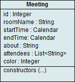
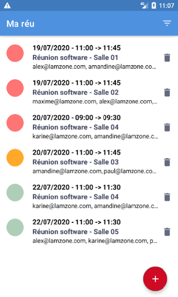
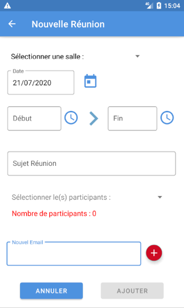
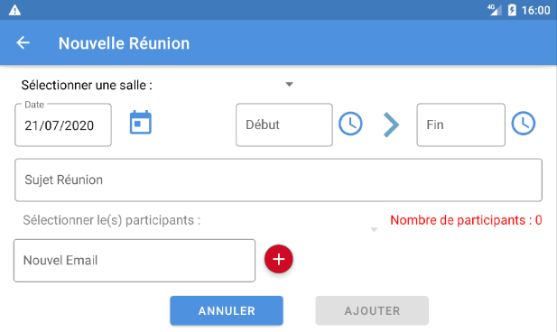

#  Mareu

### Présentation :
Ce dépôt contient l'application Mareu (4ème projet du parcours Développeur Android Junior d'OpenClassrooms).   
L'application est une gestion de réunions et est développée en intégralité sans base existante.  
Les principales fonctionnalités sont :  
  - Affichage de la liste des réunions avec :  
    - Cercle couleur selon l'état (voir modèle réunion ci dessous).  
    - Date, heure de début et fin.  
    - Objet et salle.  
    - Liste des emails des participants.  
  - Suppression d'une réunion.
  - Filtrage par date ou salle de la liste des réunions.
  - Création d'une réunion.

### Quelques informations sur la conception :  
Le modèle REUNION :
* Pour la couleur : Le choix  s'est porté sur un fonctionnement 'feux tricolores' :
  - Rouge = Réunion passée
  - Orange = Réunion du jour ou en cours
  - Vert = Réunion du lendemain ou ultérieure.  
* Pour les dates le choix s'est porté sur deux types Calendars car ils contiennent dates et heures.  

  

### L'interface utilisateur :
La saisie est axé sur la facilité et la rapidité pour l'utilisateur :
  * Mise en mémoire des salles et des adresses emails existantes, utilisation de spinners pour saisir ces données.  
    Spinner avec Checkbox pour sélectionner les participants.  
    Possibilité d'ajout d'adresses emails
  * Utilisation de date et time pickers pour la saisie des dates / heures.
  * Saisie contrôlée avant sa fin : la salle, la date, heure de débuts et fin sont les données majeures.  
  * Les tests sont effectués en cours de saisie sont :
      1. Salle non choisie.  
      2. Date et heure passées.  
      3. Heure de fin < heure début.  
      4. Réunion trop courte < 30 minutes.  
      5. Vérification disponibilité salle quand ces données sont remplies.  

  * L'objet de la réunion (non vide) et le nombre de particpants >= 2 sont les autres critères qui permettent la validation de la réunion.
  Un total des participants est affiché en temps réel.  
  Une nouvelle adresse Email crée   et validée s'ajoutera automatique aux participants.   

  * Gestion de l'aspect responsive sur différents périphériques ou orientations.

 ------ 

 
